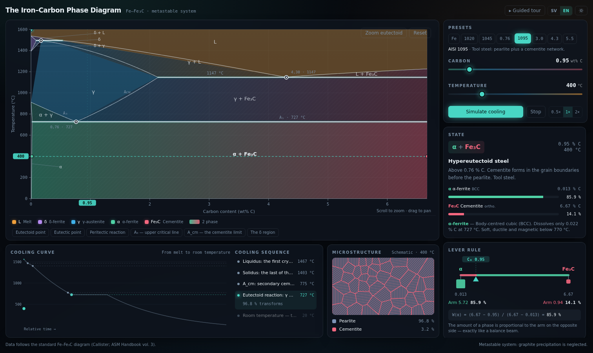
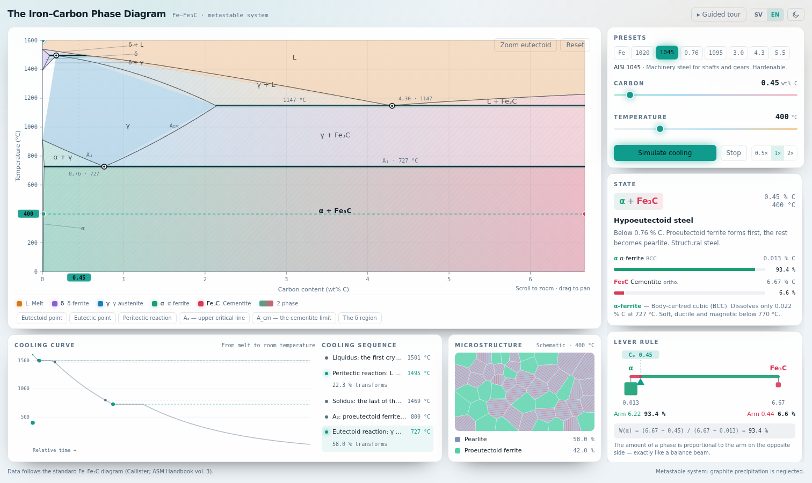

# The Iron–Carbon Phase Diagram

An interactive, physically accurate Fe–Fe₃C phase diagram — with a live lever-rule
calculator, an animated equilibrium cooling simulation, and a schematic micrograph
that is redrawn from the numbers the diagram itself produces.

Built with React, TypeScript and D3. Bilingual (Swedish / English), dark and light
themes, keyboard accessible, and deployed as a static site.



**[▶ Live demo](https://ianstanojevic.github.io/iansta/)**

---

## Why this exists

The iron–carbon diagram is the single most consulted chart in physical metallurgy —
and it is almost always shown as a static picture. Static pictures cannot answer the
questions people actually have: *how much pearlite is in a 1045 shaft? what happens
on the way down from the melt? why does cast iron pour at 1147 °C when iron melts at
1538 °C?*

This project turns the chart into an instrument. Point anywhere, and it tells you
which phases are present, in what proportion, and what the resulting microstructure
looks like.

## Features

**The diagram**

- The complete Fe–Fe₃C system, 0–6.67 wt% C and 0–1600 °C: liquidus, solidus, A₁, A₃,
  A_cm, the δ-ferrite field, and the peritectic, eutectic and eutectoid reactions.
- Eleven shaded phase fields. Single-phase fields own a hue; two-phase fields are a
  gradient between their two phases, so the colour at any point tells you which phase
  you are closest to.
- Hover anywhere for temperature, carbon content, the phases present and — inside a
  two-phase field — their weight fractions.
- Wheel zoom and shift-drag pan, plus a one-click zoom into the eutectoid region,
  which is unreadable at full scale.

**Interaction**

- Drag the marker anywhere in the plot, or use the composition and temperature
  sliders, or the arrow keys.
- **Lever rule**, drawn as an actual lever: the tie line is the beam, the alloy
  composition is the fulcrum, and each phase hangs at its end with a mass
  proportional to its weight fraction. The worked formula is shown with the live
  numbers substituted in.
- **Cooling simulation**: pick a composition, press play, and the marker walks down
  the cooling curve from melt to room temperature while a timeline calls out every
  reaction it passes — with the fraction of the alloy that transforms at each one.
- **Microstructure**: a schematic micrograph that updates with the marker —
  proeutectoid ferrite, lamellar pearlite colonies, grain-boundary cementite
  networks, ledeburite, and a melt.
- **Presets** for the alloys people actually ask about: ARMCO iron, AISI 1020 / 1045 /
  1095, eutectoid steel, and cast irons at 3.0, 4.3 and 5.5 wt% C.
- A five-step **guided tour** that drives the app while it explains it.


## The metallurgy

The app models the **metastable Fe–Fe₃C system** — cementite is treated as a stable
line compound and graphite precipitation is neglected, which is the basis of
essentially all steel practice. Values follow the standard published diagram
(Callister, *Materials Science and Engineering*; ASM Handbook vol. 3):

| Reaction | Temperature | Composition | Equation |
| --- | --- | --- | --- |
| Peritectic | 1495 °C | 0.17 wt% C | L (0.53) + δ (0.09) → γ (0.17) |
| Eutectic | 1147 °C | 4.30 wt% C | L → γ (2.14) + Fe₃C → *ledeburite* |
| Eutectoid | 727 °C | 0.76 wt% C | γ → α (0.022) + Fe₃C → *pearlite* |

Other anchors: iron melts at 1538 °C, δ → γ at 1394 °C, γ → α at 912 °C; maximum
carbon solubility is 0.09 wt% in δ, 2.14 wt% in γ and 0.022 wt% in α; cementite is
6.67 wt% C.

Two consequences worth pointing out, because the app makes them visible:

- **Austenite dissolves 100× more carbon than ferrite.** That single fact — 2.14 %
  versus 0.022 % — is why steel can be heat treated at all.
- **The eutectic sits 391 °C below the melting point of pure iron.** That is why cast
  iron is cast and steel is forged.

## How it is built

The interesting part of this project is not the drawing — it is that there is exactly
**one** description of the diagram's topology, and everything else is derived from it.

`isothermalSection(T)` returns the ordered list of phase fields crossed when walking
from 0 to 6.67 wt% C at a given temperature. That one function feeds:

- the **shaded fields** — each polygon is sampled out of the isothermal cuts rather
  than hand-drawn, so the shading can never drift away from the maths;
- the **tooltip and side panel** — the segment containing the marker *is* the phase
  field, and its edges *are* the tie line, so the lever rule falls straight out;
- the **cooling simulation** — reactions are found by watching the phase field change
  as temperature drops and then bisecting to the exact transition temperature, rather
  than hard-coding "steel does A, cast iron does B";
- the **micrograph** — constituent fractions come from the same lever-rule results,
  and grains are allocated *by area*, so if the diagram says 51 % pearlite then 51 %
  of the drawn area is pearlite.

Some details worth a look:

- **Phase boundaries** (`src/domain/curves.ts`) are stored as monotone shape functions
  sampled into dense piecewise-linear anchors. That keeps them smooth on screen while
  staying exactly invertible — `compositionAt(T)` is a true inverse of `tempAt(c)`,
  which is what makes the isothermal cut cheap.
- **The cooling curve** (`src/domain/cooling.ts`) is a real integration of Newtonian
  cooling, slowed in proportion to how fast solid is forming. Invariant reactions
  produce thermal arrests whose *length* scales with how much of the alloy actually
  transforms — which is why 4.3 % C shows one long plateau at 1147 °C while 0.2 % C
  shows a short one at 727 °C.
- **The peritectic** is measured by the austenite it produces, not by the melt present:
  a 0.45 % C alloy is 82 % liquid at 1495 °C but only 22 % of it reacts. Getting this
  wrong is easy and the unit tests pin it down.
- **D3 does the maths, React owns the DOM.** Nothing is appended imperatively; the
  whole picture is a pure function of (size, zoom transform, marker, theme).



## Running it

```bash
npm install
npm run dev        # http://localhost:5173
npm test           # unit tests
npm run build      # production build into dist/
npm run preview    # serve the production build
```

Node 20 or newer.

## Tests

The physics has unit tests, because a phase diagram that is quietly wrong is worse
than no phase diagram:

```
src/domain/curves.test.ts          boundary geometry, monotonicity, tempAt/compositionAt round-trips
src/domain/diagram.test.ts         field classification, isothermal-cut topology, textbook phase splits
src/domain/leverRule.test.ts       the lever rule, including degenerate tie lines
src/domain/cooling.test.ts         reaction sequences and sizes for steels and cast irons
src/domain/microstructure.test.ts  constituent fractions for every alloy family
```

Several of them are property tests rather than spot checks — the isothermal cut must
tile the whole composition axis with no gaps at *every* temperature, and phase
fractions must sum to 1 and stay inside [0, 1] across the entire diagram.

```bash
npm test
```

## Project structure

```
src/
├── domain/           pure, framework-free metallurgy — and where the tests live
│   ├── constants.ts       invariant points and solubility limits
│   ├── curves.ts          phase boundary geometry
│   ├── diagram.ts         isothermalSection / classifyPoint — the single source of truth
│   ├── leverRule.ts       the lever rule
│   ├── regions.ts         shaded field polygons, sampled from the isothermal cuts
│   ├── annotations.ts     drawn boundaries, invariant points, info keys
│   ├── cooling.ts         reaction sequence + cooling curve integration
│   ├── microstructure.ts  phases → microconstituents
│   └── alloys.ts          presets
├── components/       PhaseDiagram, LeverRuleCalculator, CoolingCurve, MicrostructureView, …
├── hooks/            element size, zoom behaviour, cooling playback
├── store/            Zustand store (marker, playback, theme, language)
├── theme/            palette and colour mixing
└── i18n/             Swedish and English copy, typed so a missing key is a build error
```

The `domain/` layer has no React, no D3 and no DOM in it. It is plain TypeScript that
happens to know metallurgy, which is why it can be tested in milliseconds.

## Tech

React 18 · TypeScript · Vite · D3 (scale, shape, zoom, delaunay) · Tailwind CSS ·
Framer Motion · Zustand · Vitest

## Deployment

`.github/workflows/deploy.yml` type-checks, tests and builds on every push and pull
request, and publishes the repository's default branch to GitHub Pages. Enable it once
under **Settings → Pages → Source → GitHub Actions**.

The build uses a relative base path, so the same `dist/` also works on Vercel,
Netlify, or any static file server without reconfiguration.

## Limitations

Honest about what it is: an **equilibrium** diagram. It describes slow cooling only.
There is no martensite, no bainite and no TTT/CCT kinetics here — quench a 1045 fast
enough and reality departs from this chart entirely. Graphite formation (the stable
Fe–C system) is also outside scope, as are alloying elements, which shift the
eutectoid in ways a binary diagram cannot show.

## Licence

MIT — see [LICENSE](LICENSE).
